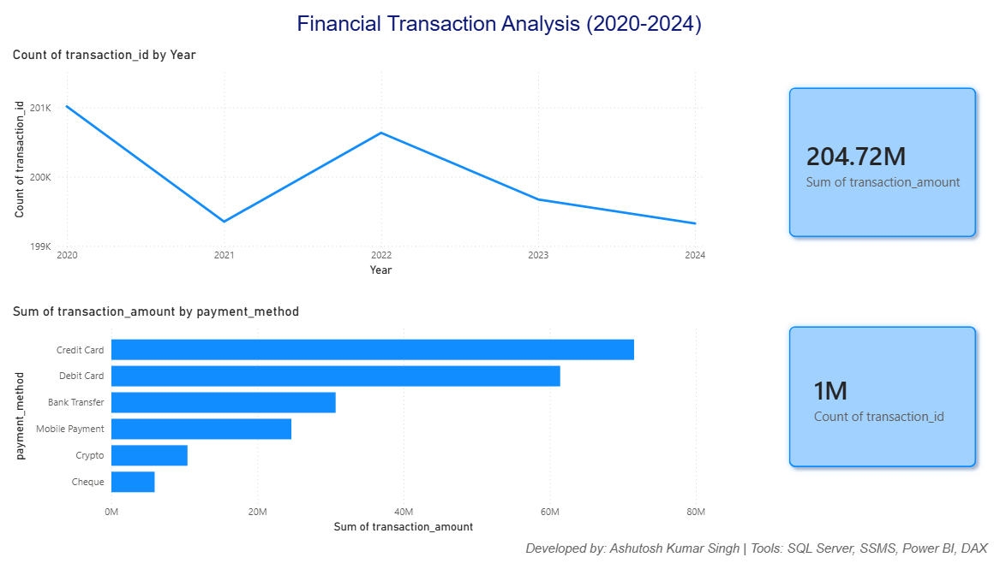
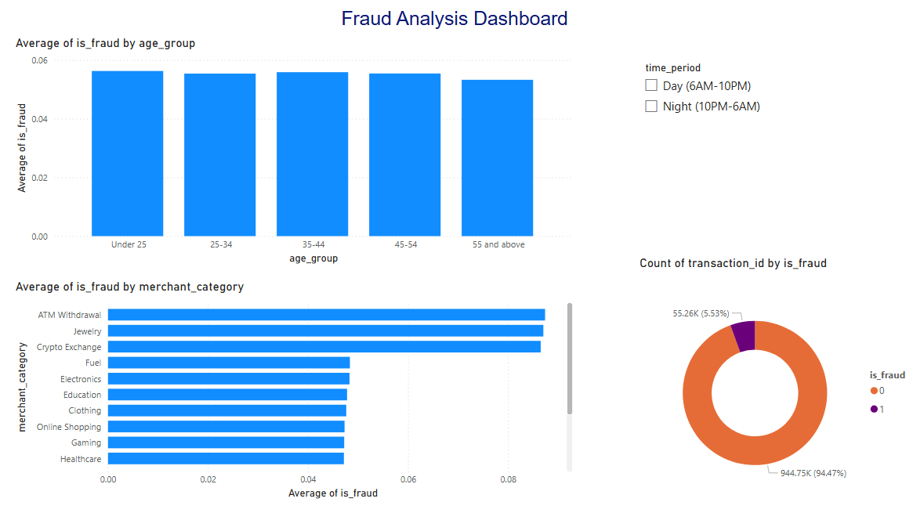
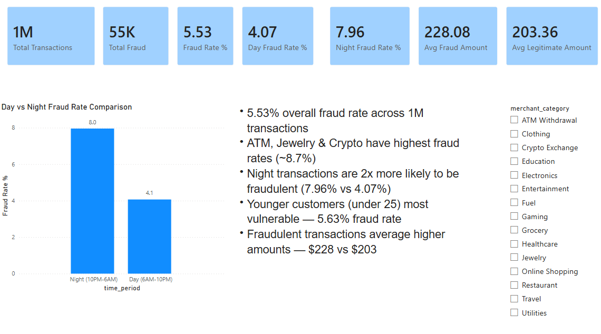

# Financial Transaction Fraud Analysis

## Project Overview
End-to-end fraud detection analytics project analyzing 1 million bank transactions across 5 years using SQL Server and Power BI.

## Tools & Technologies
- **SQL Server (SSMS)** — Database setup, data loading, analytical queries
- **Power BI** — Interactive dashboard connected directly to SQL Server
- **DAX** — Calculated columns for age groups and time period labels

## Dataset
- **Source:** Kaggle — Bank Transaction Fraud Detection Dataset
- **Period:** 2020 to 2024 (5 years)
- **Volume:** 1,000,000 transactions — 26 columns
- **Fraud Rate:** 5.53% (realistic imbalanced dataset)

## Database Setup
- **Server:** SQL Server (localhost\SQLEXPRESS)
- **Database:** FinancialAnalysis
- **Table:** transactions

## What I Did
1. **Database Setup** — Created SQL Server database, imported 1M row CSV using SSMS Import Flat File wizard
2. **SQL Analysis** — Wrote 7 T-SQL queries analyzing fraud patterns across payment methods, devices, merchant categories, age groups and time of day
3. **DAX Columns** — Created calculated columns for age_group and time_period labels
4. **Power BI Dashboard** — Built 3-page interactive dashboard connected directly to SQL Server

## SQL Queries Written
| Query | Purpose |
|-------|---------|
| Transaction Overview by Year | Volume and amount trends 2020-2024 |
| Fraud vs Legitimate | Overall fraud rate and amount comparison |
| Fraud by Payment Method | Highest risk payment channels |
| Fraud by Device Type | Fraud rate across Mobile, ATM, Desktop, Tablet, POS |
| Fraud by Age Group | Vulnerable customer segments |
| Fraud by Merchant Category | Highest risk merchant types |
| Night vs Day Comparison | Time-based fraud patterns |

## Dashboard Pages
- **Page 1 — Transaction Overview:** 1M transactions card, 204.72M total amount card, yearly trend line chart, transactions by payment method bar chart
- **Page 2 — Fraud Analysis:** Fraud vs legitimate donut chart, fraud by merchant category, fraud by age group, day/night slicer
- **Page 3 — Key Insights:** 5 business insight cards

## Key Business Insights
1. **5.53% overall fraud rate** — fraudulent transactions average higher amounts ($228 vs $203)
2. **ATM, Jewelry & Crypto highest risk** — fraud rates of ~8.7%, nearly double the average
3. **Night transactions 2x more fraudulent** — 7.96% vs 4.07% during daytime
4. **Under 25 most vulnerable** — highest fraud rate at 5.63%
5. **Fraud spread evenly across channels** — payment method and device type show minimal impact

## Dashboard Screenshots
### Transaction Overview

### Fraud Analysis

### Key Insights

## Project Structure
financial_analysis/
├── analysis_queries.sql                    # 7 SQL Server analytical queries
├── Financial_Fraud_Analysis_Dashboard.pbix # Power BI dashboard file
├── Transaction_Overview.png                # Dashboard screenshot
├── Fraud_Analysis.png                      # Dashboard screenshot
└── Key_Insights.png                        # Dashboard screenshot

## Author
**Ashutosh Kumar Singh**
- LinkedIn: linkedin.com/in/ashuks
- Email: Singhashu1339@gmail.com
